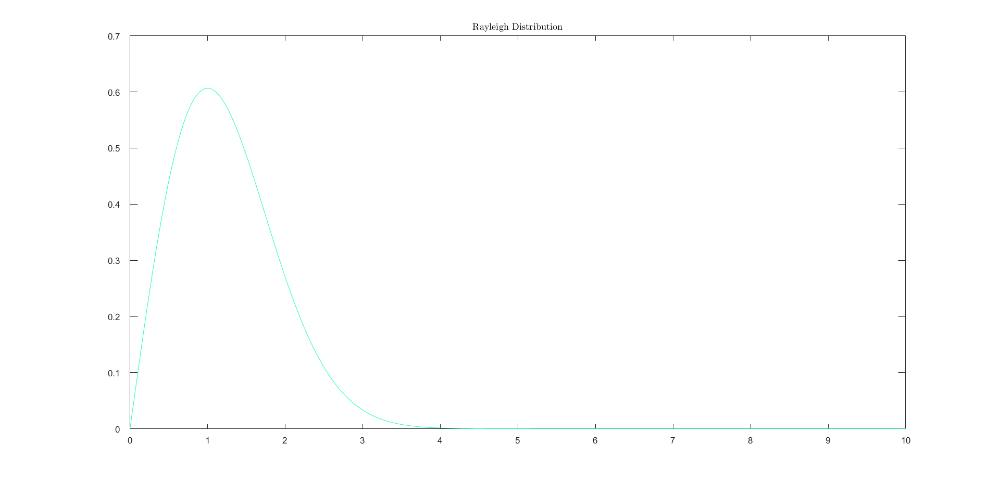

# Communication-System-Project
Rayleigh distribution, Random Process and Quantization in Communication Systems
 In this project, we have three parts. 

1. Rayleigh Distribution : In the first part, we will review the Rayleigh distribution.

2. Random Processes : In the second part, we will analyze a random process to see if it is a Stationary Stochastic Process (WSS). If it's not, we will explore ways to make it a WSS process.

3. Quantization : In the third part, we will focus on pulse modulation and work on building a digital transmitter and receiver that can handle noise and decoding.

1-1: Plotting the probability density function (PDF) of the Rayleigh distribution
 

1-2: Plotting the PDF of two random variables with a Normal distribution having a mean of zero and a variance of one

1-3: Generating and plotting Rayleigh random variable using two normal random variables

 1-4: The Impact of Increasing N

 When we increase the value of `N` from 1000 to 100000, the histogram tends to be more accurate because we have a larger number of samples to represent the distribution of the data. With a larger sample size, the histogram bins can capture the underlying distribution more precisely, resulting in a more accurate representation of the data.

2-2: Plotting mean of random process X

 

2-3: Plotting autocorrelation of random process X

 

2-4 : Plotting mean and autocorrelation of random process X base on theoretical calculations

2-5 : 

3-1 : Definition of continuous signal and sampling and construction of discrete signals 

 
3-3 : Quantization Level Implementation

 
 3-4 : Digital conversion of quantized signals

3-5: Reception of digital signal at the receiver

3-6: Decoding of the digital signal at the receiver

